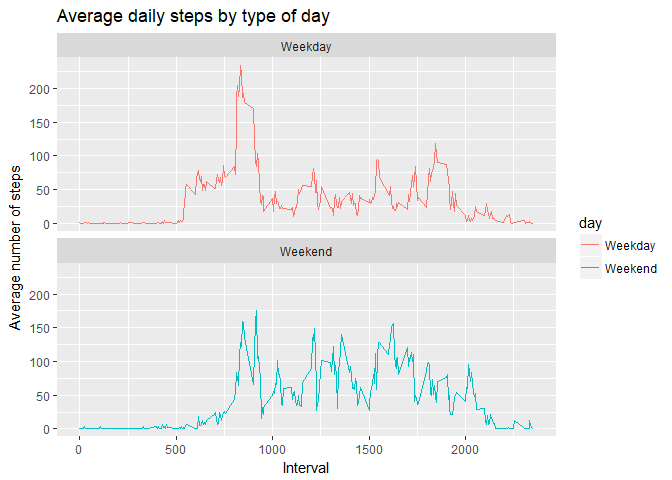

### Loading and preprocessing the data


```r
    activity_data <- read.csv(unz("activity.zip", "activity.csv"))
    activity_data_no_na <- activity_data[!is.na(activity_data$steps), ]
```

### What is the mean total number of steps taken per day?

1. Calculate the total number of steps per day


```r
    total_steps_by_day <- ddply(activity_data_no_na, .(date), summarize, steps=sum(steps))
```


2. Plot the histogran for total steps per day.


```r
    ggplot(data=total_steps_by_day, aes(x=steps)) +
        geom_histogram(fill="blue", binwidth=1000) +
        labs(title = "Histogram of steps per day", x = "Steps per day", y = "Frequency")
```

<!-- -->


3. Calculate and report the mean and median of the total number of steps taken per day


```r
    mean <- mean(total_steps_by_day$steps)
    median <- median(total_steps_by_day$steps)
```

mean = 10766.1886792453  
median = 10765


### What is the average daily activity pattern?

1. Make a time series of the 5-minute interval and the average number of steps taken, averaged across all days


```r
    average_steps <- ddply(activity_data_no_na, .(interval), summarize, average = round(mean(steps)))
    ggplot(average_steps, aes(x=interval, y=average)) +
        geom_line() +
        labs(title = "Average steps by interval", x = "Time Interval (seconds)", y = "Average steps")
```

<!-- -->


2. 5-minute interval that contains the maxiumum number of steps on average


```r
    max_steps <- max(average_steps$average)
    max_interval <- average_steps[average_steps$average == max_steps, ]
```

Maximum average number of steps in interval = 835

### Imputing missing values

1. Calculate and report the total number of missing values in the dataset

```r
    num_missing <- sum(is.na(activity_data))
```

The number of rows with missing values is 2304


2. Devise a strategy for imputing missing values  
The strategy is to use the mean for the relevant 5-minute interval.


3. Create a new dataset with missing values filled in


```r
    complete_data <- transform(activity_data, 
                               steps = ifelse(is.na(activity_data$steps),
                                              average_steps$average[match(
                                                  activity_data$interval, 
                                                  average_steps$interval)],
                                              activity_data$steps))
```


4. Make a histogram of the total steps taken each day, and calculate the mean and median total steps per day. Do these values differ from earlier and what is the effect of including the imputed data?


```r
    total_steps_by_day_imputed <- ddply(complete_data, .(date), summarize, steps=sum(steps))
    mean_imputed <- mean(total_steps_by_day_imputed$steps)
    median_imputed <- median(total_steps_by_day_imputed$steps)
    hist(total_steps_by_day_imputed$steps, breaks = 5, main = "Histogram of steps per day with imputed data", col = "red")
    hist(total_steps_by_day$steps, breaks = 5, main = "Histogram of steps per day with imputed data", col = "blue", add = T)   
    legend("topright", c("Imputed data", "NA-removed data"), fill=c("red", "blue") )
```

<!-- -->

The mean with the imputed values is 10765.6393442623 and the median is 10762. This is very similar to the original data with the NAs removed. 


### Are there differences in activity patterns between weekdays and weekends?

1. Create a new factor variable for weekend and weekday.


```r
    activity_data_no_na$date <- as.Date(strptime(activity_data_no_na$date, format = "%Y-%m-%d"))
    activity_data_no_na$day <- sapply(activity_data_no_na$date, function(date) {
        if (weekdays(date) == "Saturday" | weekdays(date) == "Sunday") {day <- "Weekend"} 
        else {day <- "Weekday"}
        day
    })
```


2. Make a panel plot containing a time series plot of the 5-minute interval and the average number of steps taken, averaged across all weekday days or weekend days.


```r
    average_day_steps <- ddply(activity_data_no_na, .(interval, day), summarize, average = round(mean(steps)))
    ggplot(average_day_steps, aes(x = interval , y = average, color = day)) +
       geom_line() +
       labs(title = "Average daily steps by type of day", x = "Interval", y = "Average number of steps") +
       facet_wrap(~day, ncol = 1, nrow=2)
```

<!-- -->


